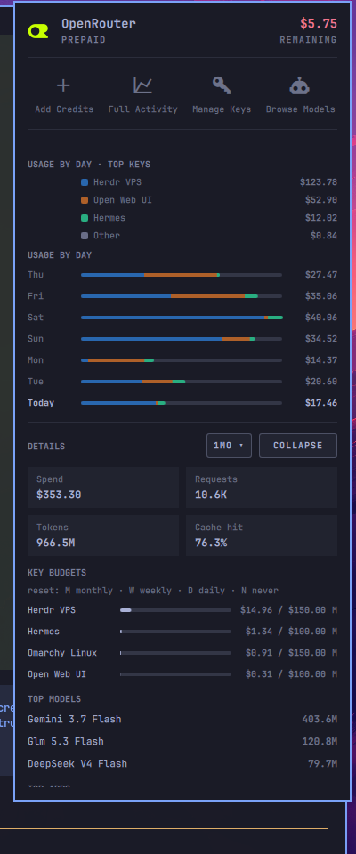

# OpenRouter Usage — Omarchy bar widget

Live OpenRouter account usage in the Omarchy (Quattro / 4.x) bar, powered entirely by OpenRouter's REST API and a **management key**. The panel shows your prepaid balance, a 7-day spend chart broken down and colored by the API keys that spent it, and Details cards with top models, apps, and keys.



- **Bar** — OpenRouter mark plus remaining prepaid credit (turns red at < 10% of your declared top-up)
- **Header** — remaining balance, tier
- **Shortcuts** — Add Credits, Full Activity, Manage Keys, Browse Models
- **Usage by day** — last 7 days of account-wide spend; each bar is segmented by the week's **top three API keys** (consistent colors across days), with everything else folded into **Other** and a ranked legend above the chart
- **Key budgets** — per-key spend caps with drain meters (from OpenRouter's per-key limits), sorted most-drained first; the gauge ramps toward red as a key approaches its cap, and a trailing letter gives the reset cadence (M monthly · W weekly · D daily · N never)
- **Details** — spend, requests, tokens, cache hit rate, top models, top apps, top keys

Derived from [calmasacow/omarchy-openrouter-usage-plus](https://github.com/calmasacow/omarchy-openrouter-usage-plus) (MIT, itself derived from sepehr500's widget).

## Requirements

- Omarchy 4.x (Quattro)
- **A management key — this is mandatory.** Create one at [openrouter.ai/settings/management-keys](https://openrouter.ai/settings/management-keys) and give it read access.

> **This plugin does not work with just a regular API key.** Unlike the plugin it derives from, it no longer reads local pi/omp session transcripts and no longer uses an inference key for the balance: every value it shows — balance, daily spend, per-key breakdowns, ranked lists — comes from endpoints that either require the management key (analytics) or are simplest to serve with it. A regular inference key (`sk-or-v1-…` from /settings/keys) is **not** needed and not read.

## Install

```bash
omarchy plugin add https://github.com/titaniumcoder/omarchy-openrouter-usage.git --enable
```

Then put your management key in place:

```bash
mkdir -p ~/.config/omarchy/agents
cp examples/config/omarchy/agents/openrouter.json ~/.config/omarchy/agents/openrouter.json
chmod 600 ~/.config/omarchy/agents/openrouter.json  # required — the collector refuses world-readable configs
$EDITOR ~/.config/omarchy/agents/openrouter.json
```

Example (`examples/config/omarchy/agents/openrouter.json`):

```json
{
  "managementKey": "sk-or-v1-REPLACE_WITH_YOUR_MANAGEMENT_KEY",
  "fundedAmount": 350
}
```

- `managementKey` (required) — read-only [management key](https://openrouter.ai/settings/management-keys). Also accepted from the `OPENROUTER_MANAGEMENT_KEY` environment variable.
- `fundedAmount` (optional) — your current top-up in USD. OpenRouter only reports the *remaining* balance, so without this the number is shown as-is; with it, the bar tracks the drained fraction and turns red at 10%.

## What it shows

| Section | Source | Notes |
|---|---|---|
| Balance / remaining | `/credits` | lifetime purchases minus lifetime usage |
| Key limit bar | `/key` | only if a per-key limit is set on the key |
| Spend by day (7 days) | `/analytics/query`, one query per day | account-wide, all keys, all devices; local-calendar day windows converted to UTC; today's partial day included |
| Usage by day (bars + top keys legend) | `/analytics/query` grouped by `api_key_id` | ranked by cost across the whole week; top 3 get fixed hues, the rest is Other; a single-key account renders plain |
| Key budgets | `/keys` | per-key cap (`limit`), current-period draw (`limit - limit_remaining`), and reset cadence; hidden entirely when no key has a cap set |
| Details cards & ranked lists | `/analytics/query` | 7d / 1mo / 3mo window, switchable in the panel |

All figures are account-global — the same panel on every machine synced to the same account shows the same numbers. Data is cached for ~5 minutes (right-click the bar mark, or press `r` in the panel, to force a refresh); a failed API probe serves the last good data instead of flickering.

## Settings

| Setting | Default | Meaning |
|---|---|---|
| `refreshIntervalSec` | 300 | How often the collector re-probes OpenRouter |
| `detailsExpanded` | false | Keep the Details section expanded across panel closes |

The panel also reacts to keyboard shortcuts when open: `r` refreshes, `d` toggles Details.

## Management key scope

The collector only *reads* from the OpenRouter API — it never creates keys, spends credit, or changes settings. A read-only management key is sufficient and recommended. The key file must be `chmod 600`; the collector silently ignores world-readable configs.

## Remove

```bash
omarchy plugin remove titaniumcoder.openrouter-usage
```

Optionally delete `~/.config/omarchy/agents/openrouter.json` and `~/.cache/omarchy/agent-usage/openrouter-*.json`. The plugin does not rewrite other config.

## Credits

- Original widget: sepehr500 / ssobhani
- Account-wide daily chart with per-key coloring: this fork
- OpenRouter "OR" glyph from OpenRouter brand assets (openrouter.ai/brand/v2). OpenRouter is a trademark of its owner; this project is not affiliated.

## License

MIT
